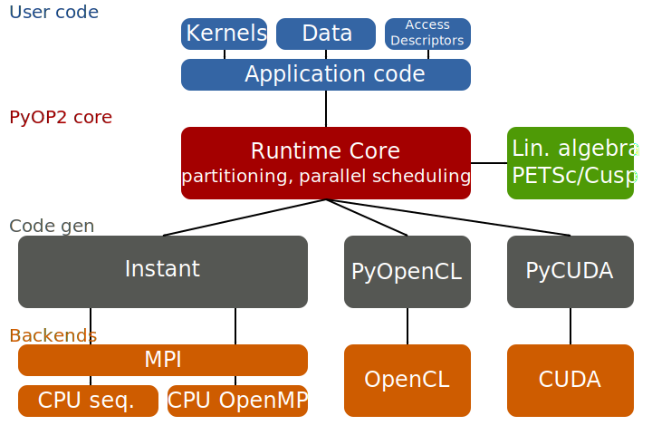
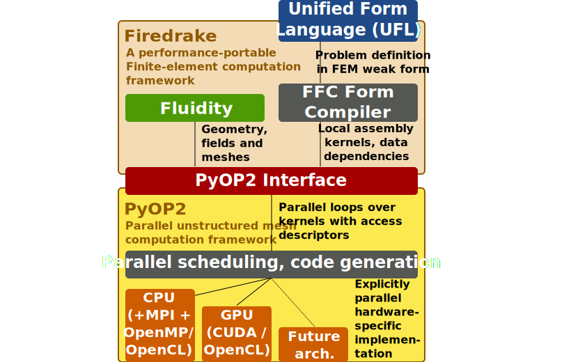
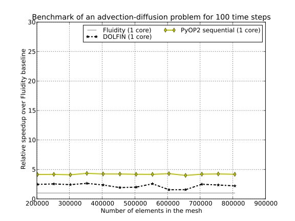
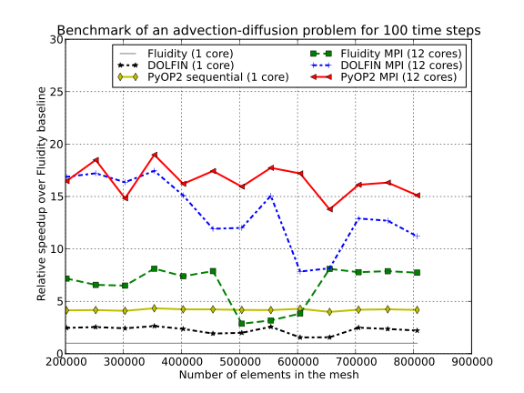

name: inverse
layout: true
class: center, middle, inverse

---

# Performance-Portable Finite-element Computations from High-level Specifications with FFC and PyOP2

### **Florian Rathgeber**<sup>1</sup>, Graham Markall<sup>1</sup>, Lawrence Mitchell<sup>3</sup>, Nicolas Loriant<sup>1</sup>, David Ham<sup>1,2</sup>, Paul Kelly<sup>1</sup>

Slides: https://kynan.github.io/CPC2013

.footnote[<sup>1</sup> Department of Computing, Imperial College London
<sup>2</sup> Grantham Institute for Climate Change, Imperial College London
<sup>3</sup> EPCC, University of Edinburgh]

---

layout: false

.left-column[
  ## Computational Science is hard

  Unless you break it down with the right abstractions

  Many-core hardware has brought a paradigm shift to CSE, scientific software needs to keep up
]
.right-column[
### High-level structure

  * Goal: producing high level interfaces to numerical computing
  * PyOP2: a high-level interface to unstructured mesh based methods  
    *Efficiently execute kernels over an unstructured grid in parallel*
  * Firedrake: a performance-portable finite-element computation framework  
    *Drive FE computations from a high-level problem specification*

### Low-level operations

  * Separating the low-level implementation from the high-level problem specification
  * Generate platform-specific implementations from a common source instead of hand-coding them
  * Runtime code generation and JIT compilation open space for compiler-driven optimizations and performance portability
]

---

background-image:url(images/fem.svg)

---

.left-column[
## UFL: High-level definition of finite-element forms

UFL is the [Unified Form Language](https://bitbucket.org/fenics-project/ufl) from the [FEniCS project](http://fenicsproject.org).
]
.right-column[
### The weak form of the Helmholtz equation

`$$\int_\Omega \nabla v \cdot \nabla u - \lambda v u ~dV = \int_\Omega v f ~dV$$`

### And its (almost) literal translation to Python with UFL

UFL: embedded domain-specific language (eDSL) for weak forms of partial differential equations (PDEs)
```python
e = FiniteElement('CG', 'triangle', 1)

v = TestFunction(e)
u = TrialFunction(e)
f = Coefficient(e)

lmbda = 1
a = (dot(grad(v), grad(u)) - lmbda * v * u) * dx

L = v * f * dx
```
]

---

.left-column[
## Helmholtz local assembly kernel generated by FFC

The [FEniCS Form Compiler](https://bitbucket.org/fenics-project/ffc) FFC compiles UFL forms to low-level code.
]
.right-column[
**Helmholtz equation**
`$$\int_\Omega \nabla v \cdot \nabla u - \lambda v u ~dV = \int_\Omega v f ~dV$$`

**UFL expression**
```python
a = (dot(grad(v), grad(u)) - lmbda * v * u) * dx
```

**Generated C code**
```c
// A - local tensor to assemble
// x - local coordinates
// j, k - 2D indices into the local assembly matrix
void kernel(double A[1][1], double *x[2],
            int j, int k) {
  // FE0 - Shape functions
  // Dij - Shape function derivatives
  // Kij - Jacobian inverse / determinant
  // W3  - Quadrature weights
  // det - Jacobian determinant
  for (unsigned int ip = 0; ip < 3; ip++) {
    A[0][0] += (FE0[ip][j] * FE0[ip][k] * (-1.0)
      + (((K00 * D10[ip][j] + K10 * D01[ip][j]))
        *((K00 * D10[ip][k] + K10 * D01[ip][k]))
      + ((K01 * D10[ip][j] + K11 * D01[ip][j]))
        *((K01 * D10[ip][k] + K11 * D01[ip][k]))
      )) * W3[ip] * det;
  }
}
```
]

---

## PyOP2 Data Model

### Mesh topology
* Sets – cells, vertices, etc
* Maps – connectivity between entities in different sets

### Data
* Dats - Defined on sets (hold pressure, temperature, etc)

### Kernels
* Executed in parallel on a set
* Read / write / increment data accessed via maps

### Linear algebra
* Matrix sparsities defined by mappings
* Matrix data on sparsities
* Kernels compute a local matrix – PyOP2 handles global assembly

---

.left-column[
## PyOP2 Kernels and Parallel Loops

Performance portability for *any* unstructured mesh computations, not limited to FEM!
]
.right-column[
### Parallel loop syntax
```python
op2.par_loop(kernel, iteration_set,
             kernel_arg1(mapping[index], access_mode),
             ...,
             kernel_argN(mapping[index], access_mode))
```

### PyOP2 kernel for re-normalising a vector field
*Direct loop*: Accessed via *identity mapping*
```python
vec_norm = op2.Kernel("""
void vec_norm(double *u)
{
  const double n = sqrt(u[0] * u[0] + u[1] * u[1]);
  u[0] /= n;
  u[1] /= n;
}
""", "vec_norm")

op2.par_loop(vec_norm, nodes,
             u(op2.IdentityMap, op2.RW))
```
Future work: define kernels as Python functions
]

---

## PyOP2 Architecture
* Parallel scheduling: partitioning, staging and coloring
* Runtime code generation and JIT compilation



---

## PyOP2 Partitioning, Staging & Coloring

### Key optimizations performed by PyOP2 runtime core
* *Partitioning* for on-chip memory (shared memory / cache)
* *Coloring* to avoid data races on updates to the same memory location

### Example

```python
# Sets of nodes and edges
nodes = op2.Set(N) # N = number of nodes
edges = op2.Set(M) # M = number of edges

# Mapping from edges to nodes
edge_to_node_map = op2.Map(edges, nodes, 2, ...)

# Data defined on nodes
u = op2.Dat(nodes, ...)

# Kernel executing over set of edges, computing on nodal data
op2.par_loop(kernel, edges,
             u(egde_to_node_map[:], op2.INC))
```

---

background-image:url(images/partitioning.svg)

---

background-image:url(images/staging.svg)

---

background-image:url(images/coloring.svg)

---

## The Firedrake/PyOP2 tool chain



---

## Two-layered abstraction: Separation of concerns


---

## Driving Finite-element Computations in Firedrake

Solving the Helmholtz equation in Python using Firedrake:
```python
import firedrake as fd
from firedrake.ufl import *

# Read a mesh and define a function space
mesh = fd.Mesh('filename')
V = fd.FunctionSpace(mesh, "Lagrange", 1)

# Define forcing function for right-hand side
def force(X):
    lmbda = 1
    n = 8
    return - (lmbda + 2*(n**2)*pi**2) * sin(X[0]*pi*n) * sin(X[1]*pi*n)
f = fd.Expression(force)

# Set up the Finite-element weak forms
u = TrialFunction(V)
v = TestFunction(V)

lmbda = 1
a = (dot(grad(v), grad(u)) - lmbda * v * u) * dx
L = v * f * dx

# Solve the resulting finite-element equation
p = Function(V)
fd.solve(a == L, p)
```

---

## Finite element assembly and solve in Firedrake

What goes on behind the scenes of the `fd.solve` call (simplified example!):
```python
from pyop2 import op2, ffc_interface

def solve(equation, x):
    # Invoke FFC to generate kernels for matrix and rhs assembly
    lhs = ffc_interface.compile_form(equation.lhs, "lhs")[0]
    rhs = ffc_interface.compile_form(equation.rhs, "rhs")[0]

    # Omitted: extract coordinates (coords), connectivity (elem_node)
    # and coefficients (field f)

    # Construct OP2 matrix to assemble into
    sparsity = op2.Sparsity((elem_node, elem_node), sparsity_dim)
    mat = op2.Mat(sparsity, numpy.float64)
    b = op2.Dat(nodes, np.zeros(nodes.size))

    # Assemble lhs, rhs and solve linear system
    op2.par_loop(lhs, elements(3,3),
                 mat((elem_node[op2.i[0]], elem_node[op2.i[1]]), op2.INC),
                 coords(elem_node, op2.READ))
    op2.par_loop(rhs, elements(3),
                 b(elem_node[op2.i[0]], op2.INC),
                 coords(elem_node, op2.READ),
                 f(elem_node, op2.READ))

    # Solve the assembled sparse linear system of equations
    op2.solve(mat, x, b)
```

---

## Speedup relative to single core Fluidity (sequential)



---

## Speedup relative to single core Fluidity (12-node MPI)



---

## Speedup relative to single core Fluidity (GPU)


---

## Conclusions and Future Work

### Conclusions
* PyOP2: a high-level interface to unstructured mesh based methods  
  *Efficiently execute kernels over an unstructured grid in parallel*
* Firedrake: a performance-portable finite-element computation framework  
  *Drive FE computations from a high-level problem specification*
* Two-layer abstraction for FEM computation from UFL sources
* Decoupling of UFL (FEM) and PyOP2 (parallelisation) layers
* Target-specific runtime code generation and JIT compilation
* Performance portability for unstructured grid applications: FEM, non-FEM or combinations

### Future Work
* Auto-tuning of optimization parameters (e.g. iteration space)
* Support for curved (isoparametric) finite elements
* Kernel fusion, lazy evaluation
* Alternative code generation / JIT approaches (LLVM)

---

## Thank you!

Contact: Florian Rathgeber, [@frathgeber](https://twitter.com/frathgeber), f.rathgeber@imperial.ac.uk

### Resources
All the code is open source under BSD or LGPLv3 license

**PyOP2**  
https://github.com/OP2/PyOP2

**FFC**  
https://bitbucket.org/mapdes/ffc

**Firedrake**  
https://code.launchpad.net/~fluidity-core/fluidity/firedrake

**Benchmarks**  
https://github.com/OP2/PyOP2_benchmarks

**This talk**  
http://kynan.github.io/CPC2013

Slides created with [remark](http://remarkjs.com)
